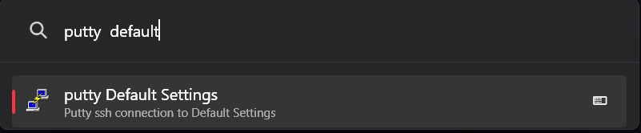

# PuTTY Sessions

PowerToys Run plugin which allows to start PuTTY with saved sessions.



## Usage

```
putty putty_session_name
```

or activate inclusion in global catalog for this plugin and use

```
putty putty_session_name
```


### Output formatting and precision

The plugin supports two modes of output:

1. Short Text: The output will only contain the target currency.
2. Full Text: The output will contain both the source and target currencies.

You can adjust the precision value in the settings. This will determine the number of decimal points to be displayed. The plugin outputs values using dynamic precision. This means that if a value is less than 1, the number of non-zero decimals displayed will be exactly as specified in the settings.


### Mathematical Calculations

You can input mathematical expressions, and the plugin will evaluate them using the BODMAS rule. The permitted operations are `+` (addition), `-` (subtraction), `*` (multiplication), and `/` (division). The use of brackets is also supported.


## Installation

There are multiple ways to install the Currency Converter plugin for PowerToys:

### Method 1: Manual Installation

1. Download the latest release of the Currency Converter from the [releases page](https://github.com/wech71/powertoys-run-putty-plugin/releases).
2. Extract the zip file's contents to your PowerToys modules directory (usually `%LOCALAPPDATA%\Microsoft\PowerToys\PowerToys Run\Plugins`).
3. Restart PowerToys to complete the installation process.

### Method 2: Executable File

1. Download the executable file for the Currency Converter plugin from the [releases page](https://github.com/wech71/powertoys-run-putty-plugin/releases).
2. Run the executable file and follow the installation instructions.
3. Restart PowerToys.

## PuTTY

This plugin requires PuTTY.exe in the search path. Visit [Simon Tathams PuTTY Release page](https://www.chiark.greenend.org.uk/~sgtatham/putty/latest.html) for the latest PuTTY version.